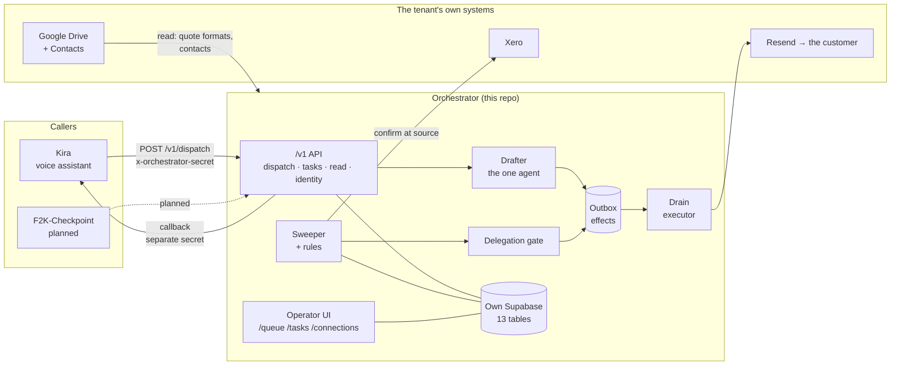

# Orchestrator — High-Level Design (as built)

**As at 2026-08-11.** This is the **as-built** view: what exists, what runs, and what is designed but
not yet written. It is deliberately different from the two design documents beside it —
`ORCHESTRATOR_SPEC.md` and `EXECUTION_LAYER.md` state what the system *should* be, and they were
written before most of it existed. Where this document and those disagree, **this one describes
reality and those describe intent.** Neither is wrong; they answer different questions.

Companion: `docs/LLD.md` — module-by-module detail, the data model, and the recipes for adding a
rule, a connection or a tool.

---

## 1. What the system is, in one paragraph

The orchestrator decides **what should happen and who must approve it**, for the ~140 business flows
in `TASK_REGISTRY.md`. It watches a projection of a business's own systems, notices what is due,
confirms it against the source of record, drafts what to say, applies a delegation policy that
decides whether a human must approve, and — only after that gate clears — hands the work to a
connector that touches the outside world. Kira is one caller of it, not its owner: the seam is a
versioned wire contract, so the whole orchestrator can be replaced by changing a base URL.

---

## 2. System context



Two things in that picture carry most of the design weight:

- **The outbox sits between deciding and doing.** Nothing that decides can also send. A handler
  *emits an effect*; a separate drain *performs* it, and only for effects that already cleared the
  gate. That inversion is what makes the approval gates structurally true rather than behaviourally
  hoped-for — an agent that talked itself into sending still has no send tool to reach for.
- **Detection and decision use different sources.** The sweep reads our local projection to find
  candidates; it then re-asks the tenant's own system before emitting anything. A projection is stale
  the moment it is written, and the concrete failure is chasing an invoice the client paid this
  morning.

---

## 3. The four moving parts

| Part | What it answers | Where | State |
|---|---|---|---|
| **Sweeper + rules** | *What is due?* | `src/sweeper.ts`, `src/rules.ts` | Built. 7 of ~20 rules written. |
| **Delegation gate** | *Who must approve it?* | `src/gate.ts`, `delegation_policy` table | Built. Bands are tenant data. |
| **Drafter** | *What exactly do we say?* | `src/drafter.ts` | Built. One agent, three owned kinds. |
| **Outbox + drain** | *Did it actually happen?* | `effects` table, `app/api/cron/drain` | Built. **One executor only: `email.send`.** |

Everything else — the API surface, the operator UI, the connectors — serves these four.

---

## 4. The register: what we actually have

This is the section to read if you want the honest inventory. Status words mean exactly what they
say: **Live** = proven against a real business; **Built** = written and exercised, not yet proven on
real data; **Designed** = specified in `EXECUTION_LAYER.md`, no code; **Absent** = neither.

### 4.1 Connections (a tenant's authorisation to read their own systems)

A connection is an OAuth grant stored per tenant in the `connections` table. It is the most sensitive
data we hold — a refresh token here is standing access to a business's finances or documents.

| Provider | Direction | Scopes / access | Status |
|---|---|---|---|
| **Xero** | read | accounting.transactions, contacts | **Live** — 7 invoices + contact emails pulled from Global Buildtech |
| **Google Drive** | read | `drive` / `drive.readonly` / `drive.file` — owner chooses | **Built**; `picked` (`drive.file`) is the least-privilege default and avoids Google's restricted-scope verification |
| **Google Contacts** | read | contacts.readonly, other.readonly | **Built** — requested alongside Drive so there is no second consent trip mid-call |
| **Google Drive** | write | `ensureFolder` + `upsertDoc` | **Built** — the record endpoint |
| MYOB, QuickBooks | read | — | **Absent** (`connections.provider` is open text, so the column is ready) |
| Simpro / ServiceM8 | read | — | **Absent** |
| Calendar, SMS, payments, telephony | — | — | **Designed** (`EXECUTION_LAYER.md` §3) |

**Adding one today costs two route files, a client module and a UI edit.** See §7.

### 4.2 Tools (the things that touch the world)

`EXECUTION_LAYER.md` §6 splits tools into **read** (available to any handler, cannot change anything)
and **effect** (never in a handler's hands — emitted, then performed by the drain). The split is real
in the code. The inventory is thin:

| Tool | Class | Effect kind | Executor | Status |
|---|---|---|---|---|
| **Send email** | effect | `email.send` | `drainEmailOutbox` via Resend | **Live** — sends as the *tenant's* legal identity, refuses commercial mail without an unsubscribe URL, blocks non-AU recipients |
| **Confirm at source** | read | — | `XeroSourceConfirmer` + a fallback | **Live** |
| **Read Drive documents** | read | — | `src/connectors/google.ts` | **Built** |
| **Look up a contact** | read | — | `src/connectors/google-contacts.ts` | **Built** |
| **Write a Drive doc** | effect | — | `record` endpoint | **Built** — *not routed through the outbox*, see §8 |
| `invoice.create`, `calendar.book`, document generation, payments | effect | — | — | **Absent** (the `effects.kind` column is open text and already documents these as examples) |

> ⚠️ **The single most important fact in this table: `effects.kind` is an open text column that can
> describe any effect, and the drain only ever queries `kind = 'email.send'`.** An effect of any
> other kind inserted today would sit in the outbox forever, with every screen looking healthy. That
> is the gap §7 closes.

### 4.3 Agents (the things that use a model)

There is **one**, and being precise about that is the point of this row:

| Agent | Job | Model | Prompts | Status |
|---|---|---|---|---|
| **The drafter** | classify a spoken request into `quote` / `email` / `reminder` / `unsupported`, then draft the content a human approves | `gpt-4.1-mini` (OpenAI, hardcoded) | inline in `src/drafter.ts` | **Live** |

Everything else in the system is deterministic. The sweeper, the gate, the connectors and the router
contain **no model in the path** — deliberately, because the twenty threshold flows must be
explainable and repeatable, and a model in that path makes "why did it send that?" unanswerable.

`ORCHESTRATOR_SPEC.md` describes four handler runtimes (mechanical / conversational / agentic /
assisted). **Mechanical is built. Conversational is the drafter, partially. Agentic and assisted do
not exist**, and they are where most of the remaining engineering lives.

The backlog for new agents is not a wish-list: `unroutable_requests` records every request nothing
could route, which makes it the evidence base for what an agent builder should build first.

### 4.4 Callers (who may talk to us)

| Caller | Tenants it may act for | Status |
|---|---|---|
| Registered callers (`ORCHESTRATOR_CALLERS`) | exactly the tenant ids listed for that caller | **Built** |
| `legacy` (`ORCHESTRATOR_SECRET`) | `*` — any tenant | **Live**, deliberately retained while Kira is on it |

The secret identifies *who is calling*; it no longer also decides *which tenant they are acting for*.
That mattered the moment a second caller appeared, and F2K-Checkpoint — itself multi-tenant — is that
second caller.

---

## 5. Trust boundaries

Four distinct secrets, on purpose, because collapsing any two of them would let one leak forge
something it should not:

| Boundary | Credential | Direction |
|---|---|---|
| Caller → us | `x-orchestrator-secret`, resolved through the caller registry | inbound |
| Us → caller | `x-orchestrator-callback-secret` | outbound |
| Kira → our consent flow | HMAC-signed, short-lived connect token | inbound, browser-borne |
| Vercel cron → us | `CRON_SECRET` bearer | inbound |

Plus two more that are not inter-system: operator sessions (Supabase magic link + `ADMIN_EMAILS`
allowlist) and the tenant OAuth grants in `connections`.

Every one is **fail-closed**: an unset secret refuses the request rather than waving it through. The
`/api/*` prefix is excluded from the auth middleware — it has to be, or the OAuth redirect back from
Google would be swallowed — so each machine route authenticates itself. That exclusion is a regex in
`middleware.ts`, and it is load-bearing.

---

## 6. The data layer, in one rule

> **We own our own records completely, and nobody else's business records at all.**

- **The entity index** (`entities`, `entity_aliases`) is a *projection*: a stable local id, enough
  attributes to resolve a name, fire a threshold and band a gate, and a pointer home. Two tables, not
  fourteen. Xero owns the invoice; we hold the fact that it is 63 days overdue.
- **Our operational records** (`tasks`, `task_events`, `effects`, `drafts`, `approvals`,
  `delegation_policy`, `unroutable_requests`) we own outright, because nobody else does.

This is `DATA_STANDARD` D1/I1 applied: the authoritative financial fact stays in the accounting
system, and we never become a second source of truth for it.

---

## 7. Extensibility — the answer to "add connections and tools by config"

The codebase already made this choice **three times**, and each time it made the thing DATA:

| Thing | Where it lives | Adding one costs |
|---|---|---|
| Sweep rules (flows) | `RULES` array, `src/rules.ts` | one object |
| Delegation bands | `delegation_policy.bands`, per tenant, in the DB | one row edit |
| Callers | `ORCHESTRATOR_CALLERS` env JSON | one env change, no deploy |

And it has **not** made that choice twice — which is exactly the gap:

| Thing | Where it lives today | Adding one costs |
|---|---|---|
| **Connections** | hardcoded: 2 route files + a client module + a hardcoded link in `/connections` | ~4 files, a deploy, and a UI edit that is easy to forget |
| **Tools / effect executors** | hardcoded: the drain queries `kind = 'email.send'` and calls one function | editing the cron route — and forgetting to leaves effects stuck silently |

**The design principle to apply is the one already in `EXECUTION_LAYER.md` §16.2: a `tool_register`
as a first-class artifact.** The recommendation is two registries, mirroring the three that work:

1. **A connector manifest** — one declarative file per provider (auth URLs, scope sets, the token
   shape, what it can confirm), consumed by *one* generic OAuth route pair and *one* connections UI
   that renders whatever is registered. What stays code is the small per-provider part that genuinely
   differs: parsing that vendor's records.
2. **A tool register** — one declarative entry per effect kind, mapping `effects.kind` → executor,
   required connection, gate class (read vs effect), and the flows it unlocks. The drain iterates the
   register instead of naming one kind.

Concrete schemas, the file layout, and what must remain code are in **`docs/LLD.md` §6**. This is a
**design, not an implementation** — neither registry exists yet.

Two constraints on any such registry, both learned here rather than assumed:

- **A registry must not be able to grant an effect a handler could invoke directly.** The read/effect
  split is the safety property; a config file that could register an effect tool *into a handler's
  tool set* would quietly undo it.
- **An unregistered effect kind must fail loudly.** The current failure mode — an unknown kind
  sitting in the outbox while every screen looks healthy — is precisely the class of silent failure
  this repo has already been bitten by twice (a hardcoded tenant constant that stopped four approved
  emails for three days; a month of failed deploys nobody saw).

---

## 8. Known gaps, in priority order

1. **The drain handles one effect kind.** Any other kind is inserted and never executed. Closing this
   *is* the tool register (§7).
2. **The Drive write path does not go through the outbox.** It is a direct endpoint, so it bypasses
   the "propose, then a separate dispatcher performs" inversion that every other effect obeys. It
   should become an effect kind.
3. **Per-tenant `live` flag.** The cron drains every tenant with pending effects. What stops a real
   business's mail going out is that it has no `delegation_policy` row, so everything holds. That is
   protection by omission, not by decision.
4. **13 of the ~20 threshold rules unwritten** — they need entity kinds no connector feeds yet.
5. **Agentic and assisted runtimes absent** — ~25% of registry flows.
6. **`tool_register` table does not exist**, so the coverage map in `EXECUTION_LAYER.md` §16 cannot be
   computed, only described.

---

## 9. Repo map

```
app/
  api/v1/         dispatch · read · tasks · tasks/[id] · tasks/[id]/approve
                  tenants/[tenantId]/{connections,identity,lookup,record}
  api/connect/    google · google/callback · xero · xero/callback
  api/cron/       sweep (hourly) · drain (15 min)
  api/auth/       callback · signout
  queue/ tasks/ connections/ settings/ login/ no-access/ unsubscribe/
src/
  contract.ts     THE SEAM — versioned wire types, and nothing else crosses it
  caller-auth.ts  who is calling, and which tenants they may act for
  sweeper.ts      sweep → threshold → confirm → compose → gate → emit
  rules.ts        the flows, as data
  gate.ts         bands resolve from the ACTION, never the flow
  drafter.ts      the one agent
  confirm.ts      source-of-record confirmation
  callback.ts     the return leg to the caller
  connect-token.ts  signed ticket so a caller can start a consent flow
  jurisdiction.ts   AU-only commercial mail (18 tests)
  connectors/     email · email-render · xero · xero-read · google · google-contacts
db/               001–007, idempotent SQL, RLS on every table
docs/             HLD.md (this) · LLD.md · SYSTEM_OF_RECORD_PORT.md
```

Design intent lives in the root markdown files (`ORCHESTRATOR_SPEC.md`, `EXECUTION_LAYER.md`,
`TASK_REGISTRY.md`, `ADMISSION_TESTS.md`, …). Current state of play is `STATE.md`.

---

## 10. Verification

CI (`.github/workflows/gate.yml`) runs on every PR, every push to main, and **daily** — typecheck,
tests, the caller-auth boundary checks, build, then `portfolio-gate-deploy-status`, which asserts
that production is running the commit we think it is. The daily run matters as much as the push one:
the outage that check exists for was a credential that expired *between* pushes, so no commit would
have caught it.
